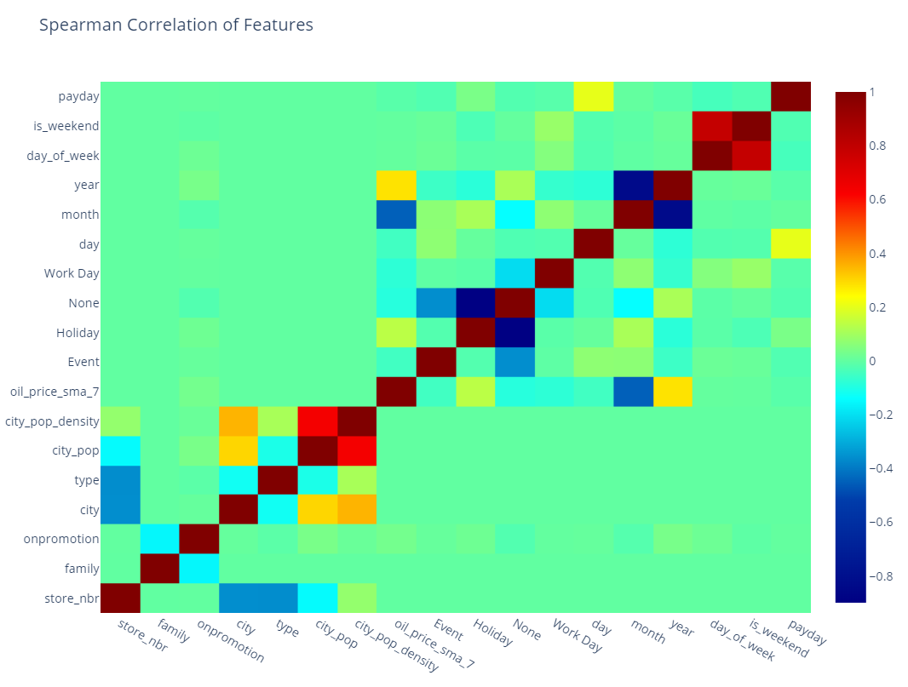

# Background
Difficult ML problem involving Multivariate Time Series. Forecasting grocery sales for massive grocery chain in South America. 

# Methodology
Used LGBM over each separate store/product family for a total of 1783 models.

# Score
Ranked 159 out of 803 with a RMSLE score of 0.4335

## Notes
Removed training data because github doesn't allow >100MB files without workaround.

Competition found here: https://www.kaggle.com/competitions/store-sales-time-series-forecasting

